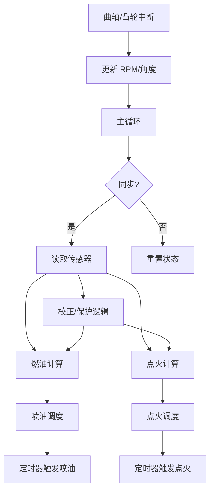

# Speeduino 传感器读取与执行器控制的软件设计流程

## 1. 设计核心思想

- **事件驱动**：硬件中断（曲轴信号）触发高优先级任务，主循环处理低实时性任务。
- **分层架构**：传感器 → 数据处理 → 控制算法 → 执行器。
- **全局状态共享**：所有模块通过 `currentStatus` 结构体交换数据，避免直接耦合。

## 2. 系统流程总览



## 3. 详细流程分解

### 步骤 1：曲轴中断处理（最高优先级）
- **代码文件**：`timers.ino` / `decoders.ino`
- **流程**：
    1. 曲轴齿触发硬件中断，执行 `triggerHandler()`。
    2. 计算齿间隔时间，更新 `currentStatus.RPM`。
    3. 检测同步齿（凸轮信号），标记 `currentStatus.hasSync = true`。
    4. 仅记录时间，不执行复杂计算，确保中断快速退出。

### 步骤 2：主循环调度（非实时任务）
- **代码文件**：`speeduino.ino`
- **流程**：

```cpp
void loop() {
  // 优先级 1：处理通信（调参/日志）
  if (Serial.available()) serialReceive();

  // 优先级 2：按定时标志更新传感器
  if (BIT_CHECK(LOOP_TIMER, BIT_TIMER_1KHZ)) readMAP();
  if (BIT_CHECK(LOOP_TIMER, BIT_TIMER_4HZ)) readCLT();

  // 优先级 3：同步引擎控制
  if (currentStatus.hasSync) {
    calculateFuel();  // 燃油计算
    calculateIgn();   // 点火计算
    checkProtection();// 保护逻辑
  }

  // 优先级 4：执行器输出
  updateInjectors();  // 喷油
  updateIgnition();   // 点火
  idleControl();      // 怠速阀
}
```

### 步骤 3：传感器 → 全局状态

- **数据流**：
    - `readMAP()` → `currentStatus.MAP`
    - `readTPS()` → `currentStatus.TPS`
    - `readCLT()` → `currentStatus.coolant`
- **设计特点**：
    - **多频率采样**：高频传感器（如 MAP）1kHz，低频（如温度）4Hz。
    - **滤波处理**：滑动平均或软件去抖（如 TPS 防抖）。

### 步骤 4：控制算法

#### 燃油计算链：
```cpp
getVE1()                 // 查燃油表 → VE 值
→ PW()                   // 计算脉宽（含校正因子）
→ setFuelSchedule()      // 调度喷油
```

#### 点火计算链：
```cpp
getAdvance1()            // 查点火表 → 提前角
→ calculateIgnitionAngles() // 计算闭合角
→ setIgnitionSchedule()  // 调度点火
```

### 步骤 5：执行器输出

#### 喷油定时器：
```cpp
// scheduledIO.ino
setFuelSchedule(fuelSchedule1, angleToTime(openAngle), pulseWidth);
// 定时器到期时触发：
digitalWrite(pinInjector1, HIGH);  // 喷油开始
delayMicroseconds(pulseWidth);
digitalWrite(pinInjector1, LOW);   // 喷油结束
```

#### 点火定时器：
```cpp
setIgnitionSchedule(ignitionSchedule1, angleToTime(advanceAngle), dwellTime);
// 定时器到期时触发：
digitalWrite(pinCoil1, HIGH);  // 线圈充电
delayMicroseconds(dwellTime);
digitalWrite(pinCoil1, LOW);   // 触发火花
```

## 4. 关键设计模式

- **模式 1：生产者-消费者模型**
    - 生产者：曲轴中断 (`triggerHandler`) 生产 RPM 和角度数据。
    - 消费者：主循环 (`loop`) 消费数据，计算控制参数。
    - 缓冲区：`currentStatus` 结构体作为共享数据池。

- **模式 2：观察者模式**
    - 主题：传感器数据更新（如 `currentStatus.MAP` 变化）。
    - 观察者：控制算法（如 `PW()` 监听 MAP 变化，重新计算喷油量）。

- **模式 3：策略模式**
    - 策略接口：`getVE1()` 和 `getAdvance1()` 的实现依赖 `configPage` 配置。
    - 动态切换：通过 `configPage2.fuelAlgorithm` 切换燃油算法（Speed Density 或 Alpha-N）。

## 5. 实时性保障机制

- **中断最小化**：曲轴中断仅记录时间，复杂计算推迟到主循环。
- **定时器抢占**：喷油/点火定时器使用硬件定时器，优先级高于主循环。
- **任务分频**：
    - 1kHz：MAP 读取（高动态响应需求）。
    - 10Hz：怠速控制（PID 运算频率适中）。
    - 1Hz：风扇控制（低优先级）。

## 6. 异常处理

- **同步丢失**：若 `currentStatus.hasSync` 为假，关闭所有执行器。
- **超限保护**：

```cpp
if (currentStatus.RPM > revLimit) {
  fuelChannelsOn = 0;  // 切断喷油
  ignitionChannelsOn = 0; // 切断点火
}
```

- **传感器失效**：默认值回退（如 TPS 失效时使用 MAP 替代）。

## 总结

Speeduino 的软件设计通过中断驱动、全局状态共享和分层任务调度，实现了多传感器与执行器的高效协同。其核心思想是：

- **实时性关键路径**：曲轴中断 → 定时器调度 → 执行器输出。
- **模块解耦**：传感器、算法、执行器通过 `currentStatus` 交互，易于扩展和维护。
