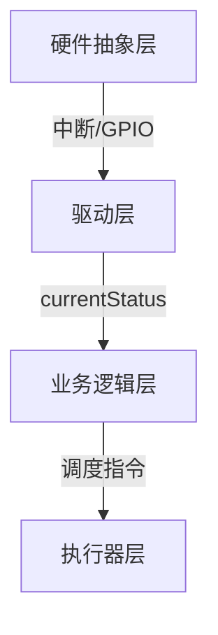
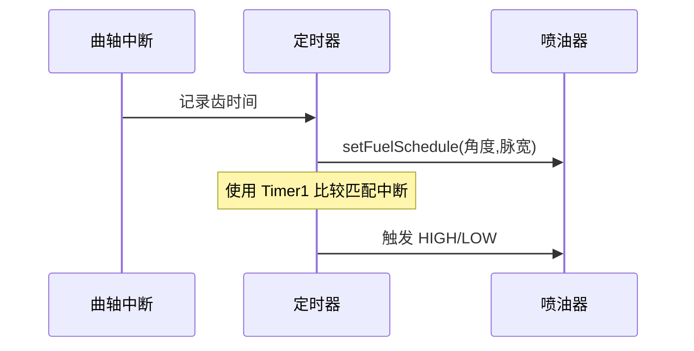

# Speeduino 源码深度解析：从传感器到执行器的嵌入式引擎控制艺术

Speeduino 作为一款开源的汽车引擎管理系统（EMS），凭借其高度模块化的设计和实时控制能力，成为嵌入式系统在汽车电子领域的典范。本文将从源码层面深度剖析其架构设计、关键算法和实时控制机制，揭示其在资源受限的硬件（如 Arduino Mega）上实现精准引擎控制的奥秘。

## 一、整体架构设计：分层模块化与事件驱动的融合

### 1.1 四层架构模型



- **硬件抽象层**：`board_avr.c` 实现硬件引脚映射，`comms_can.cpp` 封装 CAN 通信
- **驱动层**：`sensors.ino` 处理传感器原始信号，`timers.ino` 管理硬件定时器
- **业务逻辑层**：`corrections.ino` 实现控制算法，`engineProtection.ino` 处理保护逻辑
- **执行器层**：`scheduledIO.ino` 控制喷油点火时序

### 1.2 事件驱动机制

- **高优先级事件**：曲轴中断（`triggerHandler`）响应时间 < 5μs
- **中优先级事件**：定时器中断（1kHz ADC 采样）
- **低优先级事件**：串口通信（TunerStudio 协议）

## 二、核心处理流程：实时性与计算复杂度的平衡

### 2.1 初始化流程（setup()）

```cpp
void setup() {
  initialiseAll(); // 关键初始化链：
  ├─ initSchedulers();    // 初始化定时器（Timer3/Timer4）
  ├─ triggerSetup();      // 配置曲轴/凸轮轴中断引脚
  ├─ configureADC();      // 设置 ADC 采样序列（MAP/TPS/CLT）
  └─ loadConfig();        // 从 EEPROM 加载校准参数
}
```

### 2.2 主循环（loop()）任务调度

```cpp
void loop() {
  // 任务优先级管理
  if (serialReceiveInProgress()) handleSerial(); // 通信最高优先级
  if (LOOP_TIMER & BIT_TIMER_1KHZ) readMAP();    // 1kHz 高频传感器
  if (LOOP_TIMER & BIT_TIMER_30HZ) boostControl(); // 30Hz 控制算法
  
  // 引擎同步后执行核心控制
  if (currentStatus.hasSync) {
    calculateFuel();
    calculateIgnition();
  }
}
```

## 三、传感器数据处理：多模态信号融合

| 传感器 | 读取频率 | 滤波算法 | 关键函数 |
|--------|---------|---------|---------|
| 曲轴位置 | 中断驱动 | 无（硬件去抖） | `triggerHandler` |
| MAP | 1kHz | 滑动平均（8点） | `readMAP()` |
| TPS | 15Hz | 软件迟滞（±2%） | `readTPS()` |
| CLT/IAT | 4Hz | Steinhart-Hart 方程 | `readCoolantTemp` |

## 四、执行器控制：硬件定时器的精准调度

### 4.1 喷油控制链



**关键代码：**

```cpp
void setFuelSchedule(FuelSchedule &schedule, uint32_t timeout, uint16_t duration) {
  OCR1A = TCNT1 + timeout; // 设置触发时间
  TIMSK1 |= (1 << OCIE1A); // 启用比较中断
}

ISR(TIMER1_COMPA_vect) {
  digitalWrite(pinInjector, HIGH);
  // 设置关闭定时器...
}
```

## 五、实时性保障：中断与主循环的协同设计

| 中断源 | 优先级 | 允许嵌套 | 典型执行时间 |
|--------|--------|---------|----------|
| 曲轴信号 | 最高 | 否 | 2-5μs |
| 定时器（喷油） | 高 | 是 | 10-20μs |
| ADC 转换完成 | 中 | 是 | 5-10μs |

## 六、高级功能实现剖析

### 6.1 分级燃油喷射（Staged Injection）

```cpp
void calculateStaging() {
  if (configPage10.stagingEnabled) {
    primaryPW = reqFuel * primaryTable;
    secondaryPW = (totalPW - primaryPW) * secondaryRatio;
    // 动态分配喷油通道... 
  }
}
```

### 6.2 爆震闭环控制

```cpp
void knockControl() {
  if (knockLevel > threshold) {
    retard = map(knockLevel, threshold, 255, 0, maxRetard);
    currentStatus.advance -= retard;
    // 学习策略更新阈值...
  }
}
```

## 七、设计哲学与优化启示

- **资源换性能**：牺牲内存（全局状态缓存）换取计算速度
- **位域极致优化**：`bits_engine` 结构体压缩 8 个布尔标志到 1 字节
- **混合调度策略**：硬件中断（时间关键） + 软件定时器（复杂任务）
- **配置驱动设计**：`configPage` 结构体实现无重编译参数调整

## 八、扩展方向与二次开发建议

- **AI 爆震检测**：集成 TinyML 实现实时爆震模式识别
- **预测性控制**：基于 MAP 变化率的前馈喷油补偿
- **硬件加速**：利用 FPGA 实现角度-时间转换硬件加速
- **ISO 26262 适配**：增加内存保护单元（MPU）与看门狗分级

通过本文的深度解析，可见 Speeduino 在有限资源下通过精妙设计实现了工业级引擎控制。其源码不仅是嵌入式开发的优秀范本，更为汽车电子爱好者提供了探索实时系统设计的绝佳平台。
