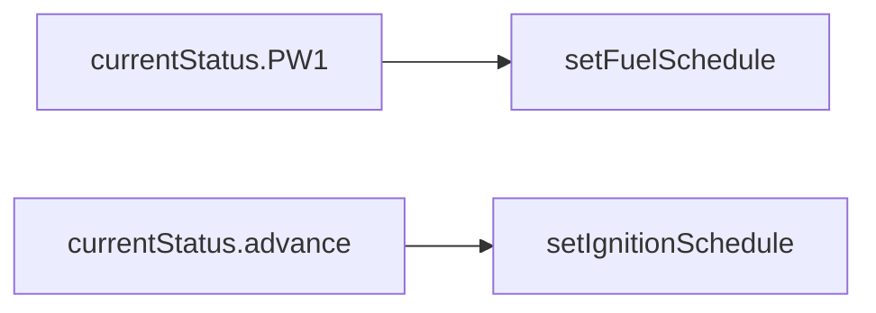

# 传感器读取函数
所有传感器数据最终更新到全局状态结构体 `currentStatus` 中。

## 1. 曲轴/凸轮位置传感器
**文件**：`decoders.ino` / `timers.ino`

**函数**：
```cpp
void triggerHandler();         // 曲轴中断处理（更新 RPM 和曲轴角度）
bool isSyncTooth();            // 检测同步齿（凸轮轴信号）
```

## 2. 进气压力传感器 (MAP)
**文件**：`sensors.ino`

**函数**：
```cpp
void readMAP();                // 读取 MAP 原始值并校准
```

## 3. 节气门位置传感器 (TPS)
**文件**：`sensors.ino`

**函数**：
```cpp
void readTPS();                // 读取 TPS 并滤波
```

## 4. 温度传感器
**文件**：`sensors.ino`

**函数**：
```cpp
void readCLT();                // 冷却液温度
void readIAT();                // 进气温度
```

## 5. 氧传感器 (O2)
**文件**：`sensors.ino`

**函数**：
```cpp
void readO2();                 // 窄带氧传感器
void readO2_2();               // 第二氧传感器（双排气配置）
```

## 6. 爆震传感器
**文件**：`engineProtection.ino`

**函数**：
```cpp
void readKnockSensor();        // 爆震信号检测（需硬件支持）
```

## 7. 车速传感器 (VSS)
**文件**：`sensors.ino`

**函数**：
```cpp
uint16_t getSpeed();           // 读取车速脉冲信号
```

# 执行器控制函数
执行器操作通过硬件引脚输出或 PWM 信号控制。

## 1. 喷油器控制
**文件**：`scheduledIO.ino`

**函数**：
```cpp
void setFuelSchedule();        // 设置喷油定时器（通道 1-8）
// 示例：
setFuelSchedule(fuelSchedule1, timeout, duration); // 通道1喷油
```

## 2. 点火线圈控制
**文件**：`scheduledIO.ino`

**函数**：
```cpp
void setIgnitionSchedule();    // 设置点火定时器（通道 1-8）
// 示例：
setIgnitionSchedule(ignitionSchedule1, timeout, dwell);
```

## 3. 怠速控制阀 (IAC)
**文件**：`idle.ino`

**函数**：
```cpp
void idleControl();            // PID 控制步进电机/PWM 阀
void setIdlePWM(byte duty);    // 直接设置 PWM 占空比
```

## 4. 燃油泵控制
**文件**：`sensors.ino`

**宏定义**：
```cpp
#define FUEL_PUMP_ON()  digitalWrite(pinFuelPump, HIGH)
#define FUEL_PUMP_OFF() digitalWrite(pinFuelPump, LOW)
```

## 5. 散热风扇控制
**文件**：`sensors.ino`

**函数**：
```cpp
void checkFan();               // 根据水温控制风扇
#define FAN_ON()   digitalWrite(pinFan, HIGH)
#define FAN_OFF()  digitalWrite(pinFan, LOW)
```

## 6. 涡轮增压控制 (Boost)
**文件**：`auxiliaries.ino`

**函数**：
```cpp
void boostControl();           // PWM 控制增压电磁阀
```

## 7. 可变气门正时 (VVT)
**文件**：`auxiliaries.ino`

**函数**：
```cpp
void vvtControl();             // 控制 VVT 电磁阀
```

## 8. 氮气喷射控制 (NOS)
**文件**：`nitrous.ino`

**函数**：
```cpp
void nitrousControl();         // 氮气系统激活与燃料补偿
```

# 关键全局状态变量 (`currentStatus`)

## 传感器数据：
```cpp
currentStatus.RPM          // 转速（来自曲轴中断）
currentStatus.MAP          // 进气压力
currentStatus.TPS          // 节气门开度
currentStatus.coolant      // 冷却液温度
currentStatus.O2           // 氧传感器电压
```

## 执行器状态：
```cpp
currentStatus.PW1-PW8      // 喷油脉宽
currentStatus.dwell        // 点火闭合时间
currentStatus.idleLoad     // 怠速阀开度
```

# 数据流与控制链

## 传感器 → 全局状态
```mermaid
graph LR
  A[曲轴中断] --> B[currentStatus.RPM]
  C[readMAP] --> D[currentStatus.MAP]
  D --> E[getVE1()]
```

## 全局状态 → 执行器


# 代码定位建议

## 传感器入口
主循环 (`loop()`) 中的 `BIT_CHECK(LOOP_TIMER, ...)` 条件触发不同频率的传感器读取。例如 `BIT_TIMER_1KHZ` 触发 `readMAP()`。

## 执行器入口
- 喷油/点火在 `loop()` 的同步检查后调用 (`if (currentStatus.hasSync)`)。
- 怠速控制、风扇等在定时任务中调用（如 `BIT_TIMER_10HZ`）。

通过此清单，可快速定位到所有传感器与执行器的代码实现位置。

